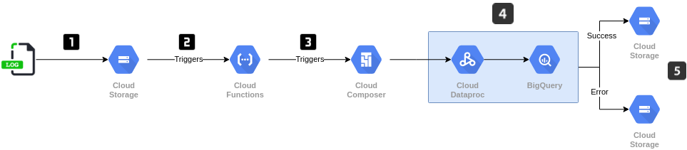

### Hard skill test for a Data Engineer position at Shape

#### Questions

On January 2020 considering GMT time zone:

1. Total equipment failures that happened?
The query:
```sql
SELECT
  COUNT(*) AS numberOfFailures
FROM
  RAW_LOGS.equipment_logs
WHERE
  DATE(eventTimestamp) BETWEEN "2020-01-01" AND "2020-01-31"
```
shows the number of failures to be 11645.

2. Which equipment code had most failures?
The query:
```sql
SELECT
  code,
  COUNT(*) AS numberOfFailures
FROM
  RAW_LOGS.equipment_logs
WHERE
  DATE(eventTimestamp) BETWEEN "2020-01-01" AND "2020-01-31"
GROUP BY code
ORDER BY numberOfFailures DESC
LIMIT 1
```
shows E1AD07D4 to be the code of the equipment with most failures.

3. Average amount of failures across equipment group, ordering by the amount of failures in ascending order?
The query:
```sql
WITH calculated_totals AS (
SELECT
  group_name,
  COUNT(*) OVER (PARTITION BY group_name) as totalFailuresPerGroup,
  COUNT(*) OVER () AS totalNumberOfFailures
  
FROM
  RAW.equipment_logs
WHERE
  DATE(eventTimestamp) BETWEEN "2020-01-01" AND "2020-01-31"
)

SELECT DISTINCT
  group_name,
  ROUND((totalFailuresPerGroup / totalNumberOfFailures), 2) AS avgFailuresPerGroup
FROM
  calculated_totals
ORDER BY avgFailuresPerGroup ASC
```
produces the following results:

| group_name | avgFailuresPerGroup |
|------------|---------------------|
| Z9K1SAP4   |                 0.1 |
| VAPQY59S   |                0.14 |
| 9N127Z5P   |                0.15 |
| NQWPA8D3   |                0.15 |
| PA92NCXZ   |                0.15 |
| FGHQWR2Q   |                0.31 |

#### Solution

The solution uses [Google Cloud Platform](https://cloud.google.com/) services.

###### Processing
For parsing the data, the chosen processing engine was [PySpark](https://spark.apache.org/docs/latest/api/python/), running on [Dataproc](https://cloud.google.com/dataproc) in a [Workflow Template](https://cloud.google.com/dataproc/docs/concepts/workflows/overview). Dataproc is a GCP service for running PySpark jobs. Dataproc Workflow Templates is a mechanism for executing Workflows in Dataproc, which consists of creating a cluster, running a graph of jobs, and deleting the cluster.
The PySpark job reads the provided files from Cloud Storage buckets, and creates a table in [BigQuery](https://cloud.google.com/bigquery), which is a serverless Data Warehouse.

###### Automation
For automating this workflow, [Cloud Functions](https://cloud.google.com/functions) was used in conjunction with [Cloud Composer](https://cloud.google.com/composer). Cloud Functions is a service to run stand-alone functions in response to events. Cloud Composer is a managed deployment of [Apache Airflow](http://airflow.apache.org/). As a new file arrives in the specified GCS bucket, a python function is executed to trigger a DAG in Airflow, using its REST API. This DAG has tasks to execute the Dataproc Workflow Template and move the file to a different bucket.

###### Infrastructure
[Terraform](https://www.terraform.io/) was used to manage all the different services and resources used in this project. Terraform is an Infrastructure as Code tool that facilitates the management of resources in the Cloud. The following tasks are performed by Terraform:

1. Creation of GCS Buckets.
2. Upload of equipments_sensors.csv and equipment.json to one of the buckets.
3. Deployment of the Cloud Composer environment.
4. Deployment of the Cloud Function.
5. Creation of the BigQuery dataset.

__Note__: The functions file has its content commented out. The reason for this is that the Composer environment must be created before the function, as information about the it must be filled in the function code before deployment. More on this in the instructions section.

###### Architecture
The developed solution follows this diagram:



1. The log file is uploaded to a GCS Bucket.
2. The object creation event triggers a Cloud Function.
3. The Cloud Function triggers an Airflow DAG on Cloud Composer.
4. The Airflow DAG runs a task to instantiate a Dataproc Workflow Template, which runs a PySpark Job to parse the log file, join it with the other two provided tables and load the results to BigQuery.
5. After processing, the file is moved to another bucket, prefixed by success or failure tags, depending on whether the processing step succeeded or failed.
#### Folders description

- __terraform__:
Contains the terraform files responsible for creating all the GCP resources.

- __dataproc__:
Contains files related to the Dataproc Workflow Template.

- __cloud-functions__:
Contains files related to the Cloud Function responsible for triggering the Airflow DAG whenever a new file is uploaded to the logs bucket in GCS.

- __composer__:
Contains the DAG file and a script for fetching the Airflow Client ID, which is needed by the Cloud Function.

- __scripts__:
Contains utility bash scripts.

#### Instructions for running the code
__Note__: The steps described here have been tested in Ubuntu 20.04.
###### GCP Setup
1. Create a new project in GCP and take note of its ID.
2. From the root folder, run:

```bash
./replace_project_id.sh YOUR_PROJECT_ID
```
this will replace a placeholder string in all the files where the project ID is used.

3. Download and install the Cloud SDK, instructions [here](https://cloud.google.com/sdk/docs/install).
4. Setup GCP authentication, instructions [here](https://cloud.google.com/docs/authentication/getting-started).

###### Terraform Setup

1. Download and install terraform, instructions [here](https://learn.hashicorp.com/tutorials/terraform/install-cli).
2. Run:
```bash
scripts/setup_terraform_backed.sh
```
which will create the Storage Bucket that serves as the backend for storing Terraform's state.

3. In the __terraform__ directory, run:

```bash
terraform init && terraform apply
```
and type in __yes__ when prompted. Wait for the process to be completed, which can take up to 40 minutes.

###### Cloud Function Setup
1. From the root folder, run:

```bash
scripts/get_composer_info.sh
```
which will print the Client ID from the IAM Proxy that protects the Airflow Webserver, and the name of the tenant project used by Cloud Composer.

2. Open the main.py file in the __cloud-functions__ directory.
Replace the variable __client_id__ with the first line from the previous command, and __webserver_id__ with the second, for example:

```python
client_id = '570589106480-bqjmtqmp32khjcg4ik45fmtcdc9iuvu9.apps.googleusercontent.com'
webserver_id = 'p1f155accc9a34acfp-tp'
```

3. From the root folder, run:

```bash
scripts/zip_cloud_function.sh
```
which will create a zip file in the __scripts__ folder containing the Cloud Function code.

4. Uncomment the code in __terraform/functions.tf__, and from the terraform folder run __terraform apply__ once again. Now only the Cloud Function will be deployed.

###### Dataproc Workflow Template
1. From the root folder, run:
```bash
scripts/deploy_workflow_template.sh
```
to copy the python file to GCS and import the Workflow Template. After this the template is ready to be used in the project.
###### Deploy and Trigger the DAG
1. From the root folder, run:

```bash
scripts/deploy_dag.sh
```
which will import the dag file from the __composer__ folder to Cloud Composer.

2. From the root folder, run:

```bash
scripts/upload_error_logs.sh
```
which will upload the error logs file to the GCS bucket being monitored by the Cloud Function.

After the DAG runs, the table will be available in BigQuery.
